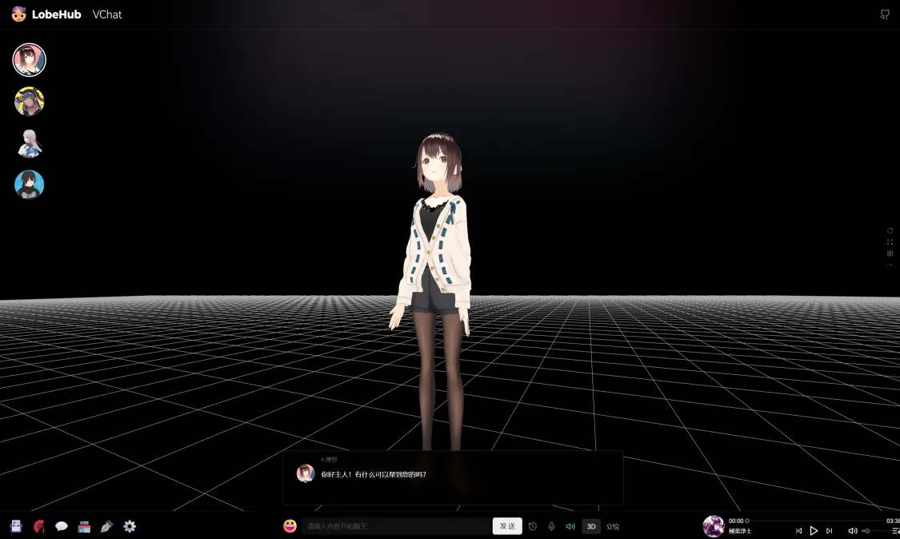

<div align="center"><a name="readme-top"></a>

<h1>VChat</h1>

Make Virtual Idols Accessible To EveryOne!

[![][github-contributors-shield]][github-contributors-link]
[![][github-forks-shield]][github-forks-link]
[![][github-stars-shield]][github-stars-link]
[![][github-issues-shield]][github-issues-link]
[![][github-license-shield]][github-license-link]

[Changelog](./CHANGELOG.md) · [Report Bug][github-issues-link] · [Request Feature][github-issues-link]


</div>

## ✨ Features



- [x] 💨 **Vroid Model Preview**: Using the Vroid Editor, you can create and upload your own virtual idol to the website, play with them;
- [x] 💎 **Exquisite UI Design**: With a carefully designed interface, it offers an elegant appearance and smooth interaction. It supports light and dark themes. PWA support provides a more native-like experience;
- [x] 🗣️ **MMD Dance Support**: With the support of mmd-parser, you can play vmd files with your favarite idol; Just Dance!

<div align="right">

[![][back-to-top]](#readme-top)

</div>

## ⌨️ Local Development

You can use Github Codespaces for online development:

[![][github-codespace-shield]][github-codespace-link]

Or clone it for local development:

[![][bun-shield]][bun-link]

```bash
$ git clone https://github.com/v-idol/vidol.chat.git
$ cd vidol.chat
$ bun install
$ bun dev
```

<div align="right">

[![][back-to-top]](#readme-top)

</div>

## 🤝 Contributing

Contributions of all types are more than welcome, if you are interested in contributing code, feel free to check out our GitHub [Issues][github-issues-link] to get stuck in to show us what you’re made of.

[![][pr-welcome-shield]][pr-welcome-link]

[![][github-contrib-shield]][github-contrib-link]

<div align="right">

[![][back-to-top]](#readme-top)

</div>

## 🔗 Links

### More Products

- **[VChat chat agents](https://github.com/v-idol/vidol-chat-agents)** - This is the Agent Index of VChat Chat. VChat Chat accesses index.json from this repo to show user the list of available agents.
- **[VChat agent sample](https://github.com/v-idol/vidol-agent-sample)** - This is the sample repo to define an AI agent in vidol.chat.
- **[VChat chat dances](https://github.com/v-idol/vidol-chat-dances)** - This is the Dance Index of VChat Chat. VChat Chat accesses index.json from this repo to show user the play list of available dances.
- **[VChat dance sample](https://github.com/v-idol/vidol-dance-sample)** - This is the sample repo to define a dance in vidol.chat.

### Credits

- **mmd-parser** - <https://github.com/takahirox/mmd-parser>
- **three-vrm** - <https://github.com/pixiv/three-vrm>
- **tts-vue** - <https://github.com/LokerL/tts-vue>

<div align="right">

[![][back-to-top]](#readme-top)

</div>

---

#### 📝 License

Copyright © 2023 [v-idol][profile-link]. <br />
This project is [MIT](./LICENSE) licensed.

[profile-link]: https://github.com/v-idol
[back-to-top]: https://img.shields.io/badge/-BACK_TO_TOP-black?style=flat-square
[github-issues-link]: https://github.com/v-idol/vidol.chat/issues
[pr-welcome-shield]: https://img.shields.io/badge/%F0%9F%A4%AF%20PR%20WELCOME-%E2%86%92-ffcb47?labelColor=black&style=for-the-badge
[pr-welcome-link]: https://github.com/v-idol/vidol.chat/pulls
[github-contrib-shield]: https://contrib.rocks/image?repo=v-idol%2Fvidol.chat
[github-contrib-link]: https://github.com/v-idol/vidol.chat/graphs/contributors
[back-to-top]: https://img.shields.io/badge/-BACK_TO_TOP-black?style=flat-square
[github-codespace-shield]: https://github.com/codespaces/badge.svg
[github-codespace-link]: https://codespaces.new/v-idol/vidol.chat
[bun-shield]: https://img.shields.io/badge/-speedup%20with%20bun-black?logo=bun&style=for-the-badge
[bun-link]: https://bun.sh
[back-to-top]: https://img.shields.io/badge/-BACK_TO_TOP-black?style=flat-square
[back-to-top]: https://img.shields.io/badge/-BACK_TO_TOP-black?style=flat-square
[github-contributors-shield]: https://img.shields.io/github/contributors/v-idol/vidol.chat?color=c4f042&labelColor=black&style=flat-square
[github-contributors-link]: https://github.com/v-idol/vidol.chat/graphs/contributors
[github-forks-shield]: https://img.shields.io/github/forks/v-idol/vidol.chat?color=8ae8ff&labelColor=black&style=flat-square
[github-forks-link]: https://github.com/v-idol/vidol.chat/network/members
[github-stars-shield]: https://img.shields.io/github/stars/v-idol/vidol.chat?color=ffcb47&labelColor=black&style=flat-square
[github-stars-link]: https://github.com/v-idol/vidol.chat/network/stargazers
[github-issues-shield]: https://img.shields.io/github/issues/v-idol/vidol.chat?color=ff80eb&labelColor=black&style=flat-square
[github-issues-link]: https://github.com/v-idol/vidol.chat/issues
[github-license-shield]: https://img.shields.io/github/license/v-idol/vidol.chat?color=white&labelColor=black&style=flat-square
[github-license-link]: https://github.com/v-idol/vidol.chat/blob/main/LICENSE
